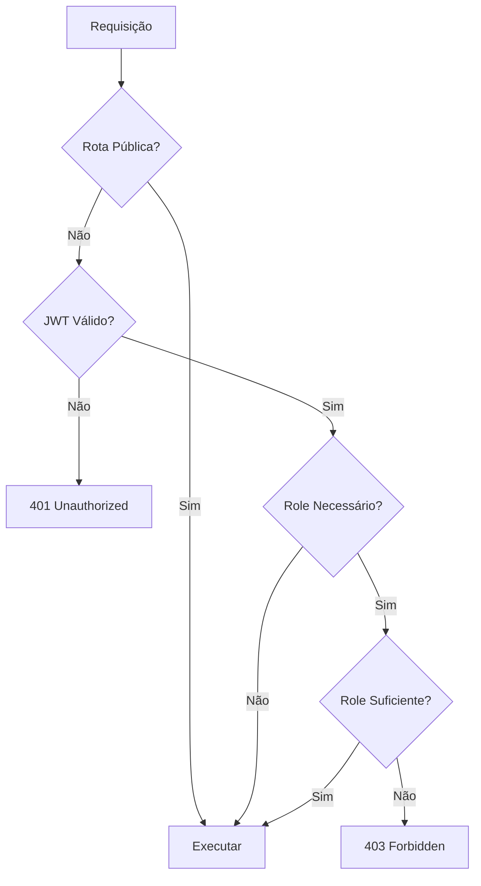

# 🔐 Sistema de Roles e Permissões

Documentação completa do sistema de autorização baseado em roles da Service Orders API.

## 📋 Índice

- [🎭 Roles Disponíveis](#-roles-disponíveis)
- [🛡️ Sistema de Permissões](#️-sistema-de-permissões)
- [🔧 Implementação](#-implementação)
- [📝 Exemplos de Uso](#-exemplos-de-uso)
- [🧪 Testes](#-testes)
- [🔍 Debugging](#-debugging)

## 🎭 Roles Disponíveis

### Hierarquia de Roles

```typescript
enum UserRole {
  ADMIN = 'admin', // Acesso total
  MODERATOR = 'moderator', // Acesso intermediário
  USER = 'user', // Acesso básico
}
```

### Permissões por Role

| Funcionalidade                 | USER | MODERATOR | ADMIN |
| ------------------------------ | ---- | --------- | ----- |
| **Ver próprio perfil**         | ✅   | ✅        | ✅    |
| **Atualizar próprio perfil**   | ✅   | ✅        | ✅    |
| **Listar usuários**            | ❌   | ❌        | ✅    |
| **Ver usuário por ID**         | ❌   | ❌        | ✅    |
| **Atualizar qualquer usuário** | ❌   | ❌        | ✅    |
| **Deletar usuário**            | ❌   | ❌        | ✅    |
| **Promover usuário**           | ❌   | ❌        | ✅    |
| **Criar pessoa**               | ✅   | ✅        | ✅    |
| **Listar pessoas**             | ✅   | ✅        | ✅    |
| **Buscar pessoa**              | ✅   | ✅        | ✅    |
| **Atualizar pessoa**           | ✅   | ✅        | ✅    |
| **Deletar pessoa**             | ✅   | ✅        | ✅    |

## 🛡️ Sistema de Permissões

### Guards Implementados

#### 1. JWT Auth Guard

```typescript
@Injectable()
export class JwtAuthGuard extends AuthGuard('jwt') {
  canActivate(context: ExecutionContext): boolean | Promise<boolean> {
    return super.canActivate(context);
  }
}
```

#### 2. Roles Guard

```typescript
@Injectable()
export class RolesGuard implements CanActivate {
  constructor(private reflector: Reflector) {}

  canActivate(context: ExecutionContext): boolean {
    const requiredRoles = this.reflector.getAllAndOverride<UserRole[]>(
      ROLES_KEY,
      [context.getHandler(), context.getClass()],
    );

    if (!requiredRoles) {
      return true;
    }

    const { user } = context.switchToHttp().getRequest();
    return requiredRoles.some((role) => user.role?.includes(role));
  }
}
```

### Decorators Customizados

#### 1. @Public()

```typescript
export const Public = () => SetMetadata('isPublic', true);
```

#### 2. @Roles()

```typescript
export const Roles = (...roles: UserRole[]) => SetMetadata(ROLES_KEY, roles);
```

#### 3. @CurrentUser()

```typescript
export const CurrentUser = createParamDecorator(
  (data: unknown, ctx: ExecutionContext): IUser => {
    const request = ctx.switchToHttp().getRequest();
    return request.user;
  },
);
```

## 🔧 Implementação

### Configuração Global

```typescript
// app.module.ts
@Module({
  providers: [
    {
      provide: APP_GUARD,
      useClass: JwtAuthGuard,
    },
    {
      provide: APP_GUARD,
      useClass: RolesGuard,
    },
  ],
})
export class AppModule {}
```

### Proteção de Rotas

#### Rotas Públicas

```typescript
@Controller('auth')
export class AuthController {
  @Public()
  @Post('login')
  async login(@Body() loginDto: LoginDto) {
    // Rota pública - sem autenticação
  }

  @Public()
  @Post('register')
  async register(@Body() registerDto: RegisterDto) {
    // Rota pública - sem autenticação
  }
}
```

#### Rotas Protegidas por Role

```typescript
@Controller('users')
export class UserController {
  @Get()
  @Roles(UserRole.ADMIN)
  async findAll() {
    // Apenas ADMIN pode listar usuários
  }

  @Get(':id')
  @Roles(UserRole.ADMIN)
  async findOne(@Param('id') id: string) {
    // Apenas ADMIN pode ver usuário por ID
  }

  @Put(':id')
  async update(
    @Param('id') id: string,
    @Body() updateUserDto: UpdateUserDto,
    @CurrentUser() currentUser: IUser,
  ) {
    // Usuário pode atualizar próprio perfil
    // ADMIN pode atualizar qualquer usuário
  }
}
```

### Validação de Permissões

#### No Service

```typescript
@Injectable()
export class UserService {
  async update(
    id: string,
    updateUserDto: UpdateUserDto,
    currentUser: IUser,
  ): Promise<IUser> {
    // Verificar se é o próprio usuário ou admin
    if (currentUser.id !== id && currentUser.role !== UserRole.ADMIN) {
      throw new ForbiddenException('You can only update your own profile');
    }

    // Remover role se não for admin
    if (currentUser.role !== UserRole.ADMIN) {
      delete updateUserDto.role;
    }

    return this.userRepository.update(id, updateUserDto);
  }
}
```

## 📝 Exemplos de Uso

### Criar Usuário Admin

```bash
curl -X POST http://192.168.31.75:3000/auth/register \
  -H "Content-Type: application/json" \
  -d '{
    "email": "admin@homelab.com",
    "password": "admin123",
    "name": "Super Admin",
    "role": "admin"
  }'
```

### Promover Usuário para Admin

```bash
# Login como admin
ADMIN_TOKEN=$(curl -s -X POST http://192.168.31.75:3000/auth/login \
  -H "Content-Type: application/json" \
  -d '{"email":"admin@homelab.com","password":"admin123"}' | jq -r '.access_token')

# Promover usuário
curl -X PUT http://192.168.31.75:3000/users/USER_ID \
  -H "Authorization: Bearer $ADMIN_TOKEN" \
  -H "Content-Type: application/json" \
  -d '{"role":"admin"}'
```

### Testar Permissões

```bash
# 1. Criar usuário comum
USER_TOKEN=$(curl -s -X POST http://192.168.31.75:3000/auth/register \
  -H "Content-Type: application/json" \
  -d '{"email":"user@test.com","password":"password123","name":"User","role":"user"}' | jq -r '.access_token')

# 2. Tentar listar usuários (deve falhar)
curl -H "Authorization: Bearer $USER_TOKEN" \
  http://192.168.31.75:3000/users
# Resposta: 403 Forbidden

# 3. Ver próprio perfil (deve funcionar)
curl -H "Authorization: Bearer $USER_TOKEN" \
  http://192.168.31.75:3000/users/profile
# Resposta: 200 OK
```

### Fluxo de Autorização



## 🧪 Testes

### Testes Unitários

```typescript
describe('RolesGuard', () => {
  it('should allow access for admin role', () => {
    const user = { role: UserRole.ADMIN };
    const context = createMockExecutionContext({ user });

    const result = rolesGuard.canActivate(context);
    expect(result).toBe(true);
  });

  it('should deny access for insufficient role', () => {
    const user = { role: UserRole.USER };
    const context = createMockExecutionContext({
      user,
      requiredRoles: [UserRole.ADMIN],
    });

    const result = rolesGuard.canActivate(context);
    expect(result).toBe(false);
  });
});
```

### Testes E2E

```typescript
describe('User Management (E2E)', () => {
  it('should allow admin to list users', async () => {
    const adminToken = await getAdminToken();

    const response = await request(app.getHttpServer())
      .get('/users')
      .set('Authorization', `Bearer ${adminToken}`)
      .expect(200);

    expect(response.body).toBeInstanceOf(Array);
  });

  it('should deny user access to list users', async () => {
    const userToken = await getUserToken();

    await request(app.getHttpServer())
      .get('/users')
      .set('Authorization', `Bearer ${userToken}`)
      .expect(403);
  });
});
```

### Script de Teste de Roles

```bash
#!/bin/bash
echo "🧪 Testando sistema de roles..."

# Criar usuários com diferentes roles
echo "1. Criando usuários:"
ADMIN_TOKEN=$(curl -s -X POST http://192.168.31.75:3000/auth/register \
  -H "Content-Type: application/json" \
  -d '{"email":"admin@test.com","password":"password123","name":"Admin","role":"admin"}' | jq -r '.access_token')

USER_TOKEN=$(curl -s -X POST http://192.168.31.75:3000/auth/register \
  -H "Content-Type: application/json" \
  -d '{"email":"user@test.com","password":"password123","name":"User","role":"user"}' | jq -r '.access_token')

# Testar permissões de admin
echo "2. Testando permissões de admin:"
echo "   - Listar usuários: $(curl -s -o /dev/null -w "%{http_code}" -H "Authorization: Bearer $ADMIN_TOKEN" http://192.168.31.75:3000/users)"
echo "   - Ver perfil: $(curl -s -o /dev/null -w "%{http_code}" -H "Authorization: Bearer $ADMIN_TOKEN" http://192.168.31.75:3000/users/profile)"

# Testar permissões de user
echo "3. Testando permissões de user:"
echo "   - Listar usuários: $(curl -s -o /dev/null -w "%{http_code}" -H "Authorization: Bearer $USER_TOKEN" http://192.168.31.75:3000/users)"
echo "   - Ver perfil: $(curl -s -o /dev/null -w "%{http_code}" -H "Authorization: Bearer $USER_TOKEN" http://192.168.31.75:3000/users/profile)"

echo "✅ Testes de roles concluídos!"
```

## 🔍 Debugging

### Verificar Role do Usuário

```bash
# Ver perfil do usuário atual
curl -H "Authorization: Bearer $TOKEN" \
  http://192.168.31.75:3000/users/profile | jq '.role'
```

### Verificar Permissões

```bash
# Testar endpoint específico
curl -v -H "Authorization: Bearer $TOKEN" \
  http://192.168.31.75:3000/users
```

### Logs de Autorização

```typescript
// Adicionar logs no RolesGuard
@Injectable()
export class RolesGuard implements CanActivate {
  canActivate(context: ExecutionContext): boolean {
    const requiredRoles = this.reflector.getAllAndOverride<UserRole[]>(
      ROLES_KEY,
      [context.getHandler(), context.getClass()],
    );

    const { user } = context.switchToHttp().getRequest();

    console.log('Required roles:', requiredRoles);
    console.log('User role:', user.role);
    console.log(
      'Has permission:',
      requiredRoles?.some((role) => user.role?.includes(role)),
    );

    return requiredRoles?.some((role) => user.role?.includes(role)) ?? true;
  }
}
```

### Middleware de Debug

```typescript
@Injectable()
export class DebugMiddleware implements NestMiddleware {
  use(req: any, res: any, next: () => void) {
    console.log('Request:', req.method, req.url);
    console.log('User:', req.user);
    console.log('Headers:', req.headers.authorization);
    next();
  }
}
```

## 📊 Monitoramento

### Métricas de Autorização

```typescript
@Injectable()
export class AuthMetricsService {
  private authSuccessCounter = new Counter({
    name: 'auth_success_total',
    help: 'Total successful authentications',
    labelNames: ['role'],
  });

  private authFailureCounter = new Counter({
    name: 'auth_failure_total',
    help: 'Total failed authentications',
    labelNames: ['reason'],
  });

  recordAuthSuccess(role: UserRole) {
    this.authSuccessCounter.inc({ role });
  }

  recordAuthFailure(reason: string) {
    this.authFailureCounter.inc({ reason });
  }
}
```

### Dashboard de Roles

```bash
# Script para monitorar uso de roles
#!/bin/bash
echo "📊 Dashboard de Roles"

# Contar usuários por role
echo "Usuários por role:"
curl -s -H "Authorization: Bearer $ADMIN_TOKEN" \
  http://192.168.31.75:3000/users | jq 'group_by(.role) | map({role: .[0].role, count: length})'

# Últimas atividades
echo "Últimas atividades:"
docker-compose logs app | grep -E "(auth|role)" | tail -10
```

## 🔒 Segurança

### Boas Práticas

1. **Princípio do Menor Privilégio**
   - Usuários têm apenas as permissões necessárias
   - Roles são específicos e bem definidos

2. **Validação Dupla**
   - Guards verificam permissões
   - Services validam novamente

3. **Auditoria**
   - Logs de todas as operações sensíveis
   - Rastreamento de mudanças de role

4. **Token Seguro**
   - JWT com expiração adequada
   - Secret forte e único

### Configurações de Segurança

```typescript
// JWT Configuration
JWT_SECRET=your-super-secret-jwt-key-here
JWT_EXPIRES_IN=7d

// Rate Limiting por Role
@Throttle(10, 60) // 10 requests per minute
@Roles(UserRole.USER)
async userEndpoint() {}

@Throttle(100, 60) // 100 requests per minute
@Roles(UserRole.ADMIN)
async adminEndpoint() {}
```

---

## 🎯 Status do Sistema de Roles

- ✅ **Roles**: ADMIN, USER, MODERATOR implementados
- ✅ **Guards**: JWT e Roles funcionando
- ✅ **Decorators**: @Public, @Roles, @CurrentUser
- ✅ **Validação**: Dupla verificação de permissões
- ✅ **Testes**: Unitários e E2E implementados
- ✅ **Debugging**: Logs e métricas configurados
- ✅ **Segurança**: Princípios implementados
- ✅ **Monitoramento**: Dashboard funcionando

**🔐 Sistema de roles e permissões totalmente funcional e seguro!**
